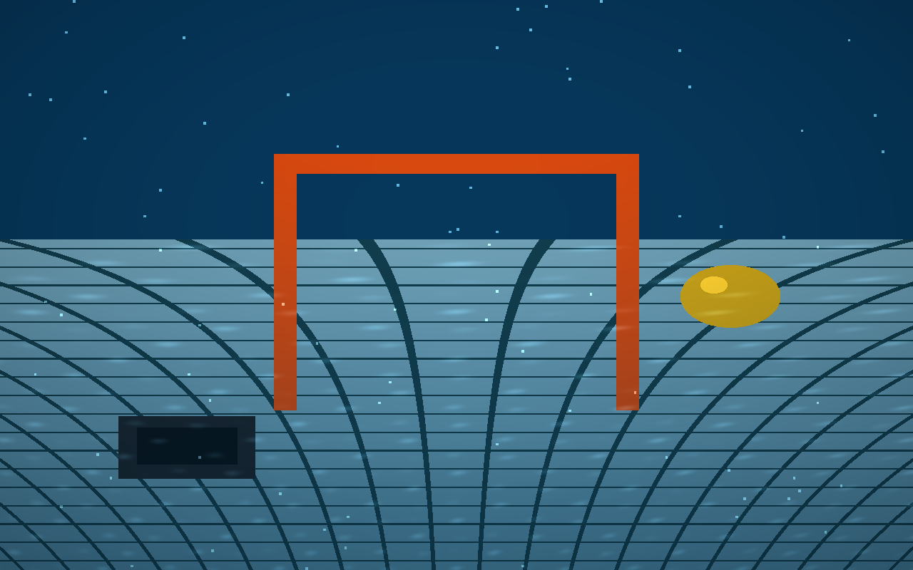
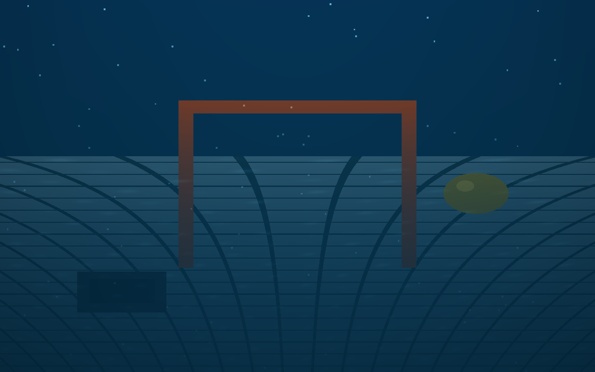
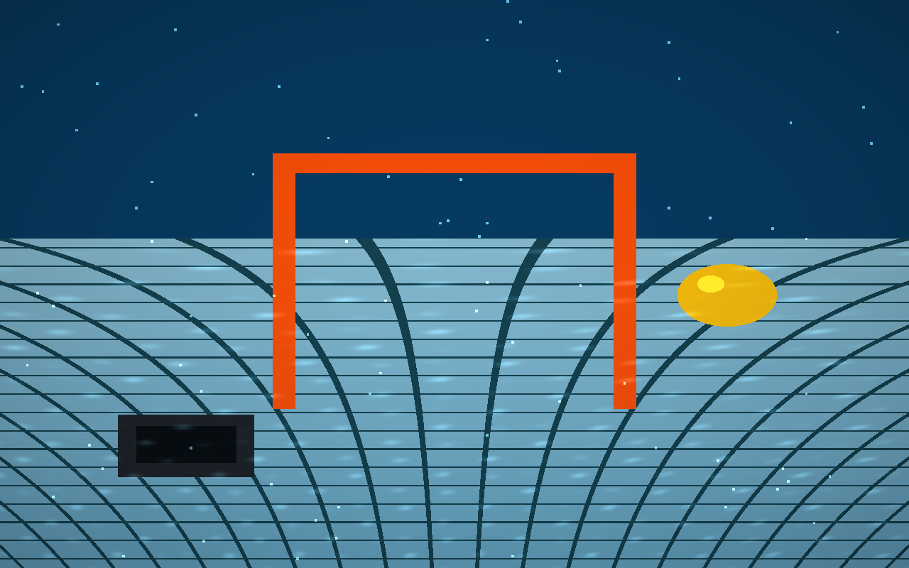

# RoboPool CPU Renderer

A single-file, dependency-free CPU port of the `robopool.slang` compute shader.
Renders an underwater robotics pool scene (gate, buoy, mission bin, tiled floor,
caustics, particles, haze, vignette) and writes a PNG — the encoder (CRC32,
Adler32, stored deflate) is built in. No GPU, no libraries.

## Run

```sh
zig run -O ReleaseFast render.zig
```

Writes `robopool.png`. Requires Zig 0.16 (uses the new `std.Io` API).

## Parameters

Edit the consts at the top of `main` in [render.zig](render.zig):

| Const       | Default | Meaning                          |
|-------------|---------|----------------------------------|
| `width`     | 1280    | Output width in pixels           |
| `height`    | 800     | Output height in pixels          |
| `time`      | 1.5     | Animation time (caustics, water) |
| `turbidity` | 1.0     | Water murkiness                  |

## Renders

### Default — `time=1.5`, `turbidity=1.0`


### Murky — `time=6.0`, `turbidity=3.0`


### Clear — `time=3.0`, `turbidity=0.2`

